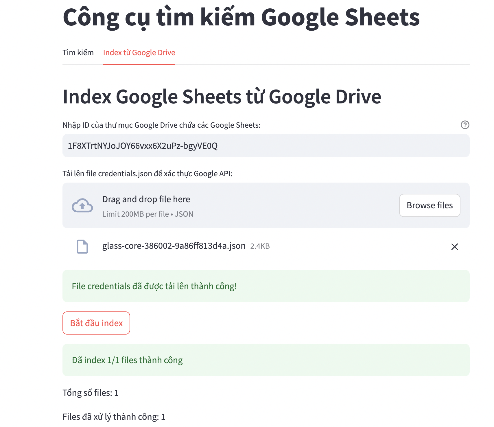
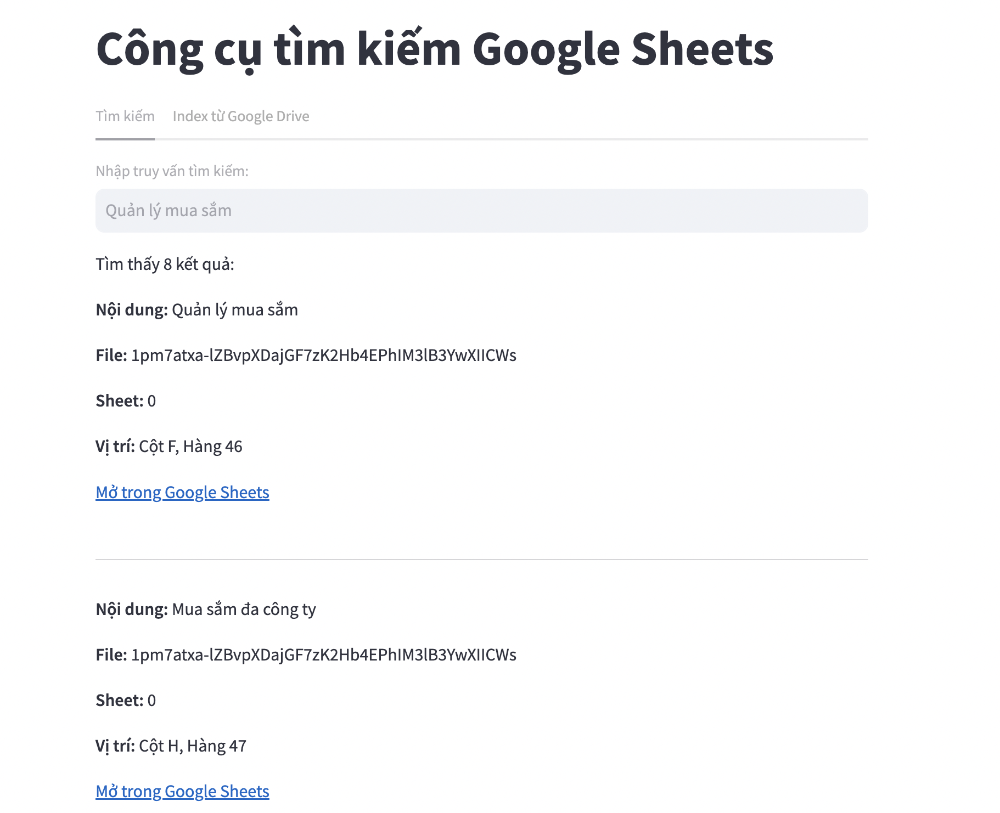

# Google Sheets Search Tool

A powerful tool for searching and indexing content from Google Sheets documents using vector search technology.




## Overview

This application indexes content from Google Sheets documents into a vector database (ChromaDB) and provides a search interface to quickly find information across multiple spreadsheets. The system connects to Google Drive to access spreadsheets, processes their content, and makes them searchable using natural language queries.

## Features

- **Vector Search**: Find relevant content across multiple Google Sheets documents using semantic search
- **Direct Links**: Get direct links to specific cells in Google Sheets where the information was found
- **Bulk Indexing**: Easily index entire folders of Google Sheets documents
- **User-friendly Interface**: Simple Streamlit interface for searching and indexing

## Setup

1. Clone the repository
2. Install dependencies:
   ```
   pip install -r requirements.txt
   ```
3. Create a `.env` file based on `.env.example`:
   ```
   OPENAI_API_KEY=your_openai_api_key
   DB_CHROMA_PATH=./data/chroma
   DB_SQLITE_PATH=./data/db.sqlite3
   ```
4. Create a Google Cloud project and enable the Google Sheets API
5. Create a service account and download the credentials JSON file
6. Place the credentials file in the `secret/` directory

## Usage

### Running the Application

```
streamlit run app.py
```

### Searching Documents

1. Navigate to the "Search" tab
2. Enter your search query
3. View the results with direct links to the specific cells in Google Sheets

### Indexing Documents

1. Navigate to the "Index from Google Drive" tab
2. Enter the ID of the Google Drive folder containing spreadsheets to index
3. Upload your Google API credentials file
4. Click "Start indexing"

## Project Structure

- `app.py` - Main Streamlit application
- `indexer.py` - Logic for indexing Google Sheets into ChromaDB
- `project_search.py` - Google Sheets connection and search utilities
- `sheet_creator_tool.py` - Tools for creating and manipulating Google Sheets
- `requirements.txt` - Project dependencies
- `chroma_db/` - Directory for the ChromaDB vector database

## Requirements

- Python 3.7+
- Google Sheets API credentials
- ChromaDB 0.4.6+
- FastAPI 0.68.0+
- Streamlit
- gspread 5.9.0+
- oauth2client 4.1.3+

## License

[MIT License](LICENSE)
